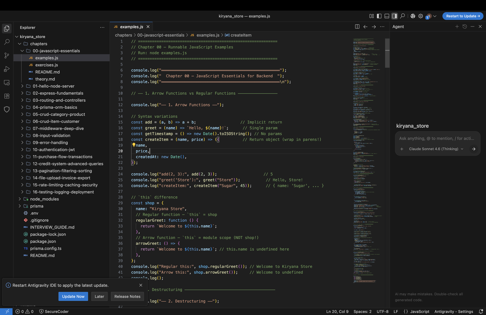

# Chapter 00 — JavaScript Essentials for Backend ⚡

## Purpose

This chapter covers **only** the JavaScript concepts you'll encounter across Chapters 1–16. No arrays/loops basics — we focus on the patterns that confuse most backend beginners: higher-order functions, closures, promises, async/await, destructuring, classes, and the module system.

## How to Use

1. Read `theory.md` — the detailed explanation of every concept
2. Run `examples.js` — each concept has runnable code with output comments
3. Complete the homework exercises in `exercises.js`

## How to Run
](image.png)
```bash
cd chapters/00-javascript-essentials
node examples.js
```

---

## Topics Covered

| # | Topic | Used In |
|---|-------|---------|
| 1 | Arrow Functions & `this` | Every controller |
| 2 | Destructuring & Spread | Every controller, middleware |
| 3 | Higher-Order Functions | `asyncHandler`, `validate()`, route handlers |
| 4 | Closures | Middleware factories, caching |
| 5 | Callbacks & the Event Loop | Ch01 raw HTTP server, streams |
| 6 | Promises | Database operations, error handling |
| 7 | Async/Await | Every Prisma query, every controller |
| 8 | Error Handling Patterns | Ch09 error classes, try/catch |
| 9 | Classes & Inheritance | Ch09 `AppError` hierarchy |
| 10 | Modules (`require` / `exports`) | Every file imports/exports |
| 11 | `globalThis` & Singletons | Ch04 Prisma client |
| 12 | Optional Chaining & Nullish Coalescing | Request parsing, defaults |
| 13 | Template Literals & Tagged Templates | Prisma `$queryRaw`, logging |
| 14 | `this`, `bind`, `apply`, `call` | Ch07 monkey-patching `res.writeHead` |

---

## 🏠 Homework

Complete all exercises in `exercises.js`. Each exercise has a description, a function signature, and test cases to validate your solution.
